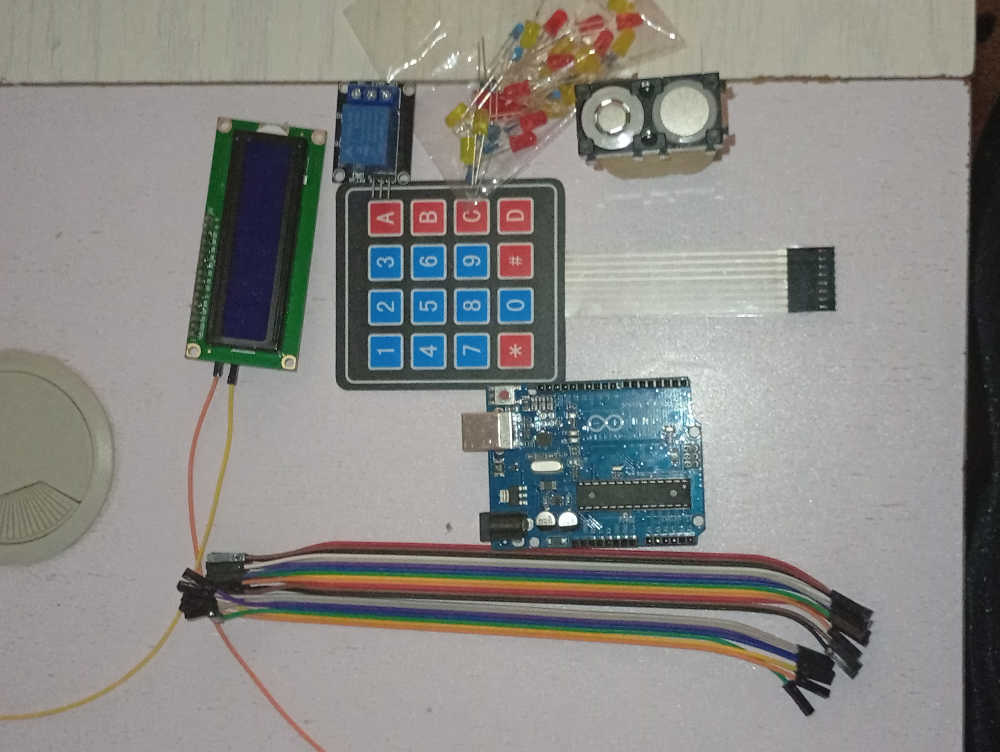

# Keypad-Based Security Lock System

A security door system project in which the passkey is requested from the user. If the user provides the right keys, access is granted, else denied. The authorized user can also change their passkey, and the new passkey is stored in EEPROM so it is retained when the system restarts.

---

## Overview

The Keypad-Based Security Lock System is built around an Arduino, a 4x4 matrix keypad, an I2C LCD display, and a relay-controlled lock. The keypad is implemented from scratch using row and column scanning — no external keypad library is used. The system prompts the user to enter an 8-digit passkey. A correct entry activates the relay to unlock the door for 5 seconds before automatically locking again. The system also supports in-place passkey changes without needing to reprogram the Arduino, as the new passkey is written to EEPROM and persists across power cycles.

---

## Features

- 8-digit passkey entry via 4x4 matrix keypad
- Relay-controlled lock — activates for 5 seconds on correct entry
- Passkey change mode — update the passkey directly from the keypad
- EEPROM storage — passkey is saved and survives power loss
- I2C LCD display — shows prompts, entry feedback, and access status
- Custom keypad scanning — implemented from scratch without any external keypad library
- Visibility toggle — press a key to reveal or hide the entered digits
- Backspace — delete the last entered character
- Clear — reset the input at any time

---

## Hardware Components

| Component | Quantity | Purpose |
|---|---|---|
| Arduino (Uno / Nano) | 1 | Main microcontroller |
| 4x4 Matrix Keypad | 1 | Passkey input |
| I2C LCD Display (16x2) | 1 | User interface and feedback |
| Relay Module | 1 | Controls the door lock mechanism |
| Door Lock / Solenoid | 1 | Physical locking mechanism |
| Jumper Wires | — | Connections |

---

## Component Reference



---

## Pin Mapping (Arduino)

| Arduino Pin | Connected To | Role |
|---|---|---|
| D3 | Keypad Row 1 | Input (PULL_UP) |
| D4 | Keypad Row 2 | Input (PULL_UP) |
| D5 | Keypad Row 3 | Input (PULL_UP) |
| D6 | Keypad Row 4 | Input (PULL_UP) |
| D7 | Keypad Col 1 | Output |
| D8 | Keypad Col 2 | Output |
| D9 | Keypad Col 3 | Output |
| D10 | Keypad Col 4 | Output |
| D12 | Relay Signal | Lock control output |
| A4 (SDA) | LCD SDA | I2C data |
| A5 (SCL) | LCD SCL | I2C clock |

---

## Keypad Layout

```
[ 1 ][ 2 ][ 3 ][ A ]
[ 4 ][ 5 ][ 6 ][ B ]
[ 7 ][ 8 ][ 9 ][ C ]
[ * ][ 0 ][ # ][ D ]
```

### Key Functions

| Key | Function |
|---|---|
| 0 – 9 | Digit entry |
| A | Change passkey mode |
| B | Clear input / return to passkey prompt |
| C | Clear input |
| D (col 1) | Toggle digit visibility |
| D (col 2) | Enter digit `0` |
| D (col 3) | Confirm / submit entry |
| D (col 4) | Backspace (delete last character) |

---

## Repository Structure

```
Keypad-Security-Lock/
├── SecurityLockWithPadChangePHiddenEEMP.ino  # Main Arduino sketch
├── IMG_20260126_164006.jpg                   # Project image
├── LICENSE
└── README.md
```

---

## Getting Started

### Prerequisites

- [Arduino IDE](https://www.arduino.cc/en/software) (1.8.x or later)
- The following libraries installed via Library Manager:
  - `LiquidCrystal_I2C` by Frank de Brabander
  - `Wire` (built-in)
  - `EEPROM` (built-in)

### Installation

1. Clone the repository
   ```bash
   git clone https://github.com/your-username/Keypad-Security-Lock.git
   cd Keypad-Security-Lock
   ```

2. Install the LCD library
   - In Arduino IDE, go to Sketch > Include Library > Manage Libraries
   - Search for `LiquidCrystal_I2C` and install it

3. Set the default passkey (first time only)
   - Open `SecurityLockWithPadChangePHiddenEEMP.ino`
   - In `setup()`, uncomment the line:
     ```cpp
     //memWrite();
     ```
   - Upload the sketch — this writes the default passkey (`27902781`) to EEPROM
   - Comment the line out again and re-upload to prevent it overwriting the passkey on every restart

4. Upload the sketch
   - Select your board under Tools > Board
   - Select the correct port under Tools > Port
   - Click Upload

---

## How It Works

### Passkey Entry

On startup, the LCD displays `Passkey:` and waits for input. Each keypress advances the cursor and stores the digit internally, displaying an asterisk in its place. After all 8 digits are entered, the user presses the confirm key (D col 3) to submit.

### Access Decision

The submitted entry is compared against the passkey stored in EEPROM character by character (using a checksum of ASCII values). If they match:

- The LCD displays `Welcome!`
- The relay activates for 5 seconds, unlocking the door
- The relay deactivates and the LCD displays `Locked!!`
- The input is cleared and the system resets

If the entry is wrong, the LCD displays `Denied!!` and the input is cleared.

### Changing the Passkey

Pressing the `A` key enters passkey change mode, which works in two steps:

1. The LCD prompts `Old Passkey:` — the user must enter and confirm the current passkey
2. If correct, the LCD prompts `New Passkey:` — the user enters and confirms the new passkey
3. The new passkey is saved to EEPROM with `EEPROM.put()` and takes effect immediately
4. The LCD displays `Changed!` and the system returns to normal

If the old passkey is entered incorrectly, access is denied and the system resets to normal mode.

### EEPROM Storage

The passkey is stored as an 8-character array starting at EEPROM address `0`. Using `EEPROM.put()` and `EEPROM.get()` ensures the passkey survives power cycles and resets without needing to reprogram the board.

### Visibility Toggle

Pressing the visibility key (D col 1) cycles between showing asterisks and showing the actual digits entered so far on the LCD, useful for verifying input before confirming.

### Backspace

Pressing the backspace key (D col 4) clears the last entered character from the display and rewinds the cursor by one position.

---

## Default Passkey

The default passkey set in the sketch is `27902781`. This is written to EEPROM on first upload (see installation step 3). Once changed via the keypad, the new passkey replaces it in EEPROM.

---

## Known Limitations

- No lockout mechanism after repeated failed attempts

---

## Future Improvements

- Add a lockout after a set number of failed attempts
- Add a buzzer for audio feedback on access granted or denied
- Implement a master reset passkey for emergency access

---

## License

This project is licensed under the MIT License. See the [LICENSE](LICENSE) file for details.
